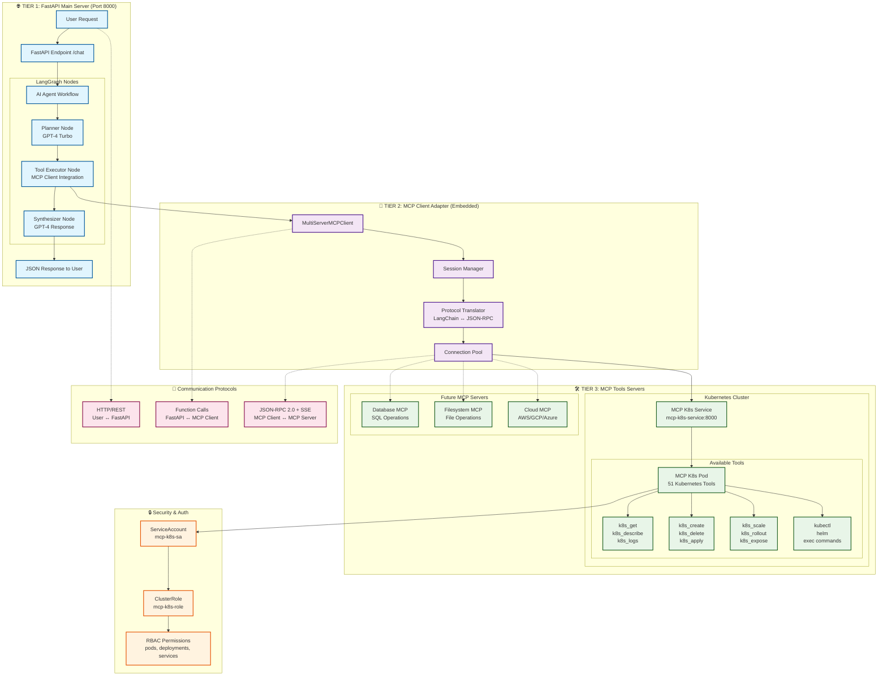

```mermaid
graph TB
    subgraph "🌐 TIER 1: FastAPI Main Server (Port 8000)"
        A[User Request] --> B[FastAPI Endpoint /chat]
        B --> C[AI Agent Workflow]
        
        subgraph "LangGraph Nodes"
            C --> D[Planner Node<br/>GPT-4 Turbo]
            D --> E[Tool Executor Node<br/>MCP Client Integration]
            E --> F[Synthesizer Node<br/>GPT-4 Response]
        end
        
        F --> G[JSON Response to User]
    end
    
    subgraph "🔄 TIER 2: MCP Client Adapter (Embedded)"
        E --> H[MultiServerMCPClient]
        H --> I[Session Manager]
        I --> J[Protocol Translator<br/>LangChain ↔ JSON-RPC]
        J --> K[Connection Pool]
    end
    
    subgraph "🛠️ TIER 3: MCP Tools Servers"
        subgraph "Kubernetes Cluster"
            K --> L[MCP K8s Service<br/>mcp-k8s-service:8000]
            L --> M[MCP K8s Pod<br/>51 Kubernetes Tools]
            
            subgraph "Available Tools"
                M --> N[k8s_get<br/>k8s_describe<br/>k8s_logs]
                M --> O[k8s_create<br/>k8s_delete<br/>k8s_apply]  
                M --> P[k8s_scale<br/>k8s_rollout<br/>k8s_expose]
                M --> Q[kubectl<br/>helm<br/>exec commands]
            end
        end
        
        subgraph "Future MCP Servers"
            K -.-> R[Database MCP<br/>SQL Operations]
            K -.-> S[Filesystem MCP<br/>File Operations]
            K -.-> T[Cloud MCP<br/>AWS/GCP/Azure]
        end
    end
    
    subgraph "🔒 Security & Auth"
        M --> U[ServiceAccount<br/>mcp-k8s-sa]
        U --> V[ClusterRole<br/>mcp-k8s-role]  
        V --> W[RBAC Permissions<br/>pods, deployments, services]
    end
    
    subgraph "🔗 Communication Protocols"
        X[HTTP/REST<br/>User ↔ FastAPI]
        Y[Function Calls<br/>FastAPI ↔ MCP Client]
        Z[JSON-RPC 2.0 + SSE<br/>MCP Client ↔ MCP Server]
    end
    
    A -.-> X
    H -.-> Y  
    K -.-> Z
    
    classDef tier1 fill:#e1f5fe,stroke:#01579b,stroke-width:2px
    classDef tier2 fill:#f3e5f5,stroke:#4a148c,stroke-width:2px  
    classDef tier3 fill:#e8f5e8,stroke:#1b5e20,stroke-width:2px
    classDef security fill:#fff3e0,stroke:#e65100,stroke-width:2px
    classDef protocol fill:#fce4ec,stroke:#880e4f,stroke-width:2px
    
    class A,B,C,D,E,F,G tier1
    class H,I,J,K tier2
    class L,M,N,O,P,Q,R,S,T tier3
    class U,V,W security
    class X,Y,Z protocol
```
